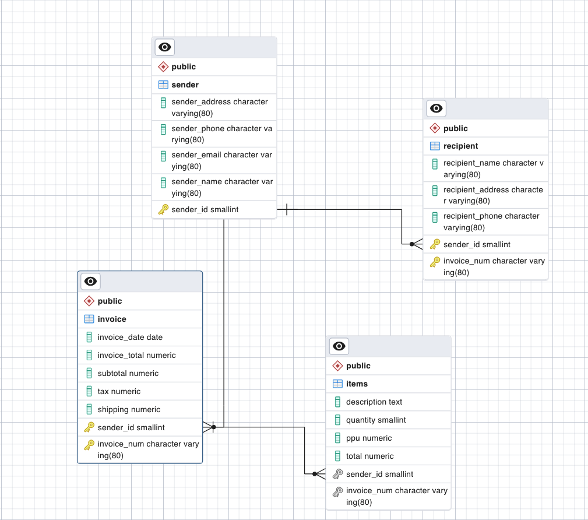

# quick-voice
Sleek and powerful invoicing application that lets users create and store business invoices. 

## Motivations
I started learning how to use and implement databases, and am looking for a project to put my skills to the test. The app is built with Go, and uses PostgreSQL for data storage.

## How to run the project.
1. Install Go
> https://go.dev/dl/

2. Install PostgresSQL and setup a local database
> https://www.postgresql.org/download/

3. Clone this repository.

4. In the project directory, run `go run .` from the terminal
